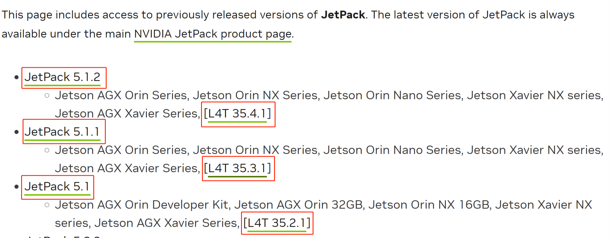

# Seeed Studio SenseCraft AI

**Upgrade Any Camera with YOLOv8, Seamlessly and No-code!**

## Introduction

SenseCraft AI is a development toolkit and platform designed for NVIDIA Jetson Edge AI devices. Simply run the "Quickstart Script" and you will be presented with an interactive user interface to view an example application with a pre-loaded video and a pre-loaded AI model. If you want to add your own USB camera, IP camera you can simply do it in a few clicks!


In addition to the various built-in AI models we offer out-of-the-box, you will also be able to bring-in your own AI model. In the future, you will have access to a large number of public models on SenseCraft AI platform and you will be able to download and deploy AI models for specific scenarios and create personalized AI solutions based on your needs. SenseCraft AI is your intelligent decision-making partner for vision ai, providing you with simple, flexible and efficient inferencing and solution building capabilities.

## Features

- Easy deployment with one-line of code
- User-friendly and streamlined user interface to build and visualize AI applications that can be accessible with just a
  browser
- Flexibility to configure multiple video streams with multiple camera inputs such as IP and USB cameras

## Client and Server Architecture

SenseCraft AI consists of a client and server architecture. The client provides the necessary API endpoints and handles the business logic for the frontend application, whereas the server is running on the Jetson device, handling input and output, enabling model switching and parameter configurations.

- [SenseCraft AI_Client](https://github.com/Seeed-Studio/SenseCraft-AI-webUI)
- [SenseCraft AI_Server](https://github.com/Seeed-Studio/SenseCraft-AI-Edge)

## **Hardware Requirements**

- NVIDIA Jetson device
- Internet connectivity via Ethernet/ WiFi
- Display

## **Sofeware Requirements**

- JetPack 5.1.1 (L4T 35.3.1)
- JetPack 5.1.1 (L4T 35.3.1)
- JetPack 5.1 (L4T 35.2.1)

> **_NOTE:_** We have tested and verified this application on a Seeed Studio [reComputer J4012](https://www.seeedstudio.com/reComputer-J4012-w-o-power-adapter-p-5628.html) powered by  NVIDIA Jetson Orin NX 16GB module running [JetPack 5.1.1](https://developer.nvidia.com/embedded/jetpack-sdk-511). However, it will work as long as you have installed the required JetPack version. Furthermore, we will update this in the future to support more JetPack versions as well.

## **Quickstart in 2 Steps!**

If you want to quickly experience this application, follow the instructions below.

1.Connect Jetson to a display and power them on
2.Type the following command on a terminal to run the application

```sh
bash ./script/edge-ai-setup.sh
```

> **_NOTE:_** The above command will download and install a Docker container which we have prepared with all the packages and
dependencies needed to run the application. Please wait patiently because it will take sometime to download the Docker
container which will be about 28GB.

## Next Steps for Developers

If you a developer, we have provided steps on how to build the application locally and run. This will allow developers to extend this application and add more features to suit their own requirements. Please follow the below instructions.

## How to Build

If you want to build this application locally, you can build as follows:

```sh
docker build -f ./docker/Dockerfile . -t sensecraft-ai
```

## How to Run

After buildig locally, you can run the application by:

```sh
docker run -d --privileged --restart=always --net=host --ipc=bridge --ipc=host --pid=host --runtime nvidia --gpus all -e DISPLAY=:0 -e EDGEAI_PORT="46654" -e EDGEAI_MODELS_PATH="/var/lib/edge/models" -e EDGEAI_SOURCES_PATH="/var/lib/edge/sources" -e EDGEAI_CONFIGS_PATH="/var/lib/edge/configs" --mount source=edge-gateway-container,target=/var/lib/edge  -v /dev:/dev -v /tmp/.X11-unix/:/tmp/.X11-unix -v /var/run/dbus/system_bus_socket:/var/run/dbus/system_bus_socket --name=sensecraft-ai sensecraft-ai
```

## Instructions for Flashing JetPack

If you have purchased reComputer J4012, it comes pre-flashed with JetPack 5.1.1. So you do not need to flash again. However, if you want to flash reComputer J4012 and other reComputer Jetson Orin based devices, you can follow [this wiki](https://wiki.seeedstudio.com/reComputer_J4012_Flash_Jetpack). Furthermore, if you want to reflash other Jetson devices, you can visit [this link](https://developer.nvidia.com/embedded/jetpack-archive) to enter the JetPack Archieve, select the JetPack version and view the flashing instructions.



After flashing the device, you can verify the L4T version by executing the below command:

```sh
cat /etc/nv_tegra_release
```

## Learning Resources

- [Deploy YOLOv8 on NVIDIA Jetson wusing TensorRT](https://wiki.seeedstudio.com/YOLOv8-TRT-Jetson)
- [Deploy YOLOv8 on NVIDIA Jetson using TensorRT and DeepStream SDK Support](https://wiki.seeedstudio.com/YOLOv8-DeepStream-TRT-Jetson)

## References

- [Ultralytics_YOLOv8](https://github.com/ultralytics/ultralytics)
- [Watchtower](https://github.com/containrrr/watchtower)

## License

This project is released under the [MIT license](LICENSES).
